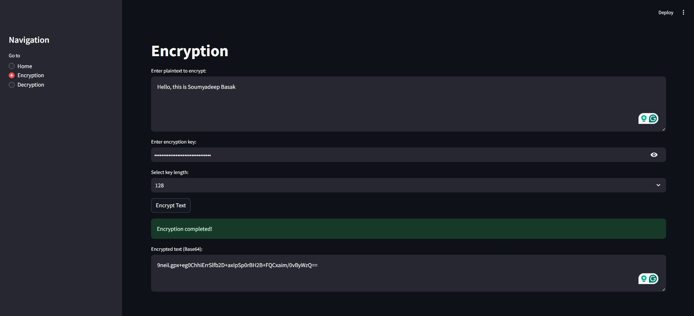
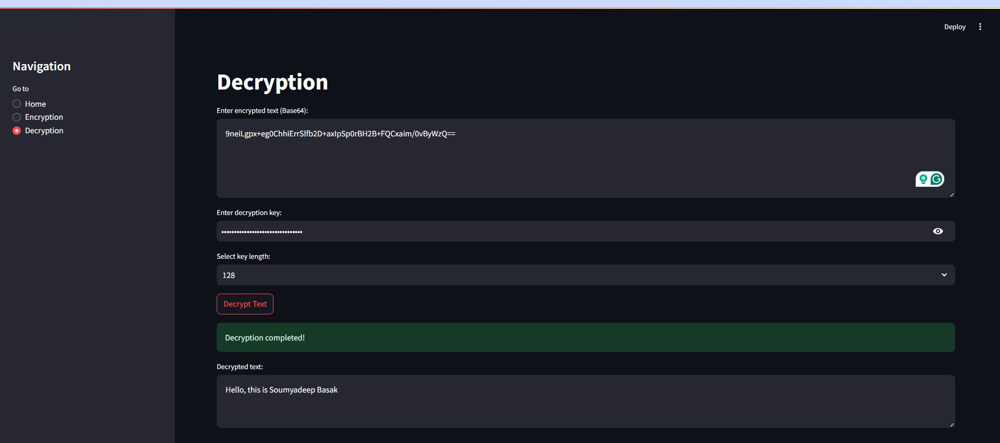

# RC5-CBC Cipher-Decipher Tool

## Overview
The **RC5-CBC Cipher-Decipher Tool** provides a user-friendly interface for encrypting and decrypting text using the RC5 algorithm in Cipher Block Chaining (CBC) mode. The tool is built with **Streamlit** to offer an interactive experience.

## Features
- **Text Encryption & Decryption** using RC5-CBC.
- **128-bit, 192-bit, and 256-bit Key Lengths**.
- **Base64 Encoding** for secure transmission.
- **Intuitive UI** for ease of use.

## Screenshots

### Encryption Process

### Decryption Process

